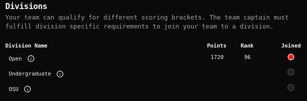
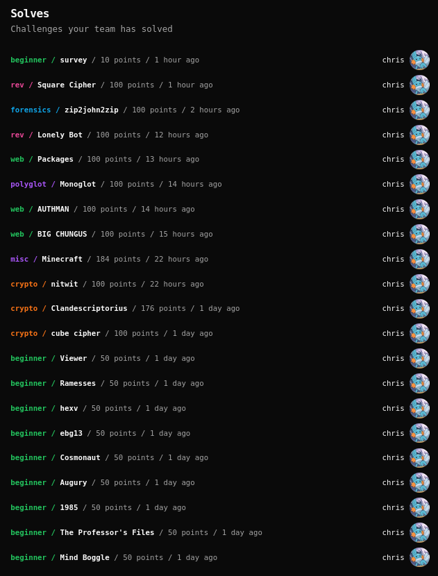

Buckeye CTF 2025
================

## Write ups
* [beginner/1985](beginner/1985/1985.ipynb)
* [beginner/Augury](beginner/Augury/Augury.ipynb)
* [beginner/Cosmonaut](beginner/Cosmonaut/Cosmonaut.ipynb)
* [beginner/ebg13](beginner/ebg13/ebg13.ipynb)
* [beginner/hexv](beginner/hexv/hexv.ipynb)
* [beginner/Mind Boggle](<beginner/Mind Boggle/Mind Boggle.ipynb>)
* [beginner/Ramesses](beginner/Ramesses/Ramesses.ipynb)
* [beginner/The Professor's Files](<beginner/The Professor's Files/The Professor's Files.ipynb>)
* [beginner/Viewer](beginner/Viewer/Viewer.ipynb)
* [crypto/Clandescriptorius](crypto/Clandescriptorius/Clandescriptorius.ipynb)
* [crypto/cube cipher](<crypto/cube cipher/cube cipher.ipynb>)
* [crypto/nitwit](crypto/nitwit/nitwit.ipynb)
* [forensics/zip2john2zip](forensics/zip2john2zip/zip2john2zip.ipynb)
* [misc/Minecraft](misc/Minecraft/Minecraft.ipynb)
* [polyglot](polyglot/polyglot.ipynb)
* [rev/Lonely Bot](<rev/Lonely Bot/Lonely Bot.ipynb>)
* [rev/Square Cipher](<rev/Square Cipher/Square Cipher.ipynb>)
* [web/AUTHMAN](web/AUTHMAN/AUTHMAN.ipynb)
* [web/BIG CHUNGUS](<web/BIG CHUNGUS/BIG CHUNGUS.ipynb>)
* [web/Packages](web/Packages/Packages.ipynb)